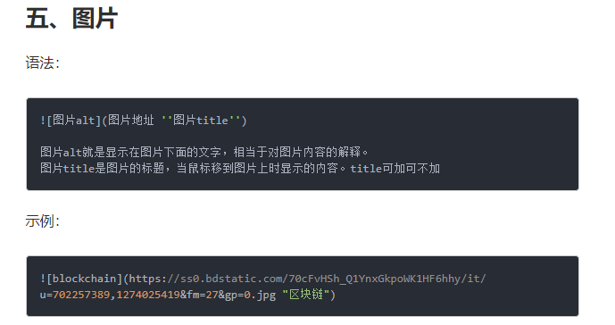

### 2019年2月21日09:37:05


# 一级标题
## 二级标题
### 三级标题
#### 四级标题

*斜体*
**加粗**
***斜体加粗***
~~删除线~~

> 一级引用
> > 二级引用
> > > 三级引用

**分割线：3个以上的-或者\***
-------
******

**图片的引入**
-------

后面的test是图片的标题 当鼠标放到上面的时候就会显示
------


超链接语法和插入图片语法差一个!
[百度](http://www.baidu.com)


无序列表
- 无序列表
+ 无序列表
* 无序列表
  * 无序列表

1. 有序列表
2. 有序列表
3. 有序列表


| 表头 | 表头  | 表头 |     |
| :--- | :---: | ---: | --- |
| 内容 | 内容  | 内容 |     |
| 内容 | 内容  | 内容 |     |

------
里面可以直接写html代码 并且可以直接显示

<div style="width:20px;height:20px;background:green;"></div>

******
如果要显示其中的一行代码 用反引号引起来就好了
`<div style="width:20px;height:20px;background:green;"></div>`

+++++++
如果要显示代码块 首尾个起一行写三个 反引号 首行反引号后面跟上语言种类
```javascript
    var x = 12;
    var y = 34;
    var z = x + y;
    console.log(z);
```

``` css
    .table{
        font-size:12px;
        font-weight:normal;
    }
```

------------
**脚注的定义和使用**
- [^1]: 脚注1
- 使用   脚注[^1]


